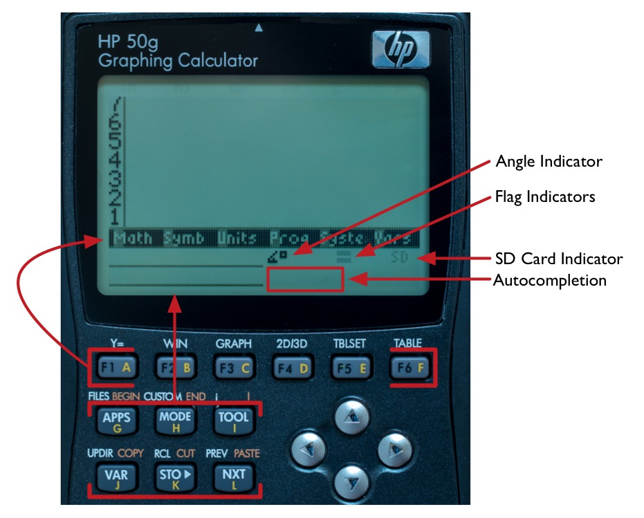

## newRPL on an HP 50g: A Practical User's Guide ##

>Document version: 0.4 (Apr 19, 2017)
 
>newRPL version that this document reflects: 0.8Alpha build 786
 
>Contributing Author(s): Steven Martin

### Contents ###

[About](#about)
 
[Where to get newRPL](#where)
 
[Disclaimer](#disclaimer)
 
[Useful links](#links)
 
[Hardware requirements](#targethardware)
 
[How to load the newRPL ROM](#romloadnewRPL)
 
[How to revert to the stock ROM](#romloadstock)
 
[User Interface](#userinterface)
 
[Calc <-> PC file IO](#calctopc)
 
[Object types and their use](#objects)
 
[Stack Editing](#stackediting)
 
[File System Operations](#filesystem)
 
[SD card access](#sdcard)
 
[Programming](#programming)
 
[Libraries](#libraries)
 
[Special Keys / Bindings](#bindings)
 
[Redefining Keys](#keyredefine)
 
[Working with Units](#units)
 
[HP stock ROM vs newRPL: Processor Speeds](#speed)
 
[HP stock ROM vs newRPL: Execution Speed Tests](#speedtests)
 
[newRPL battery life](#batterylife)
 
[HP stock ROM command reference](#commands)
 
[newRPL extended commands](#extcommands)
 
[newRPL Development toolchain](#toolchain)
 
[Contributing to newRPL](#contribute)
 
[Bug Reports](#bugs)
 
[Where to get this document](#location)
 
[Acknowledgments](#acknowledge)

----------------

### About

__Purpose of this document__
 
This document was started as an aid to help those interested in working with newRPL on an HP 50g.  Hopefully, it will serve as a resource to the community for pulling together in one place the nuts and bolts of both installing and working with newRPL.  Corrections, suggestions, and comments are wholeheartedly encouraged and welcome!

__How this document relates to various versions of newRPL__
 
newRPL is currently under very active development.  As such, things like key bindings, function syntax, even the basic interface can change.  This document will always have at the top a particular build number of the newRPL ROM, which it will reflect.

__A bit of RPL History__
 
The original **RPL** (Reverse Polish Lisp) programming language was designed and implemented by Hewlett Packard for their calculators from the mid-1980s until 2015 (the year the HP50g was discontinued).  It is based on older calculators that used **RPN** (Reverse Polish Notation).  Whereas RPN had a limited stack size of 4, RPL has a stack size only limited by memory and also incorporates programmatic concepts from LISP.  The first implementation of RPL accessible by the user was on the HP 28C (circa 1987) which had a Saturn processor.  More recent implementations (e.g., HP 49, 50g) run through a Saturn emulation layer on an ARM based processor. 

__What is newRPL?__
 
newRPL is a modern implementation of the RPL language started by Claudio Lapilli and helped by a community of calculator enthusiasts.  It was started near the end of 2013 and is still under development.  The motivation for this re-implementation is to preserve the language by making it accessible on modern platforms (a PC or some other embedded device).  The goal of the project is to create a fully functional calculator RPL environment that runs natively (as opposed to an emulation or interpreted layer) on the target hardware.  Furthermore, newRPL is also designed to be backwards compatible with the RPL language and programs that can be run on the Hewlett Packard 48/49/50g series calculators.  The newRPL project (released under the BSD open source license) implements RPL in portable C, and is initially targeted for an HP50g calculator and a PC emulator.

In HP calculator parlance there is a distinction between **User RPL** and **System RPL**.  The former is the language directly accessible to the user of an HP calculator, whereas the latter typically requires external tools and can potentially lead to system crashes.  newRPL seeks to implement **User RPL** only (System RPL was used as a lower level and faster language in the Saturn processor environment or emulation).

A typical scenario is to install newRPL on a 50g (which has the ability to replace or *flash* the operating system ROM).  Note that this procedure **completely replaces the stock HP50g ROM**, so to return the calculator to its original state would require having the HP stock ROM on hand.  See [Disclaimer](#disclaimer) and the instructions on [how to install the newRPL ROM](#romloadnewRPL). 

newRPL is different from RPL most noticeably in its speed (runs natively on the target hardware), use of 16 level greyscale, and two separate levels of soft menus that are customizable by the user.

If you are coming from the latest stock 50g ROM, it should be noted that newRPL is not designed to re-duplicate all the features of that ROM, but rather just the RPL part.  So, for example, you won't find a **CAS** (Computer Algebra System) in newRPL, nor an equation writer.  However, what you will find in newRPL is (ultimately) the 700 or so commands available in the 50g along with some additional commands not found in a 50g.

Here is a list of changes and enhancements from the stock 50g ROM:

* Difference between integers and reals based on the decimal dot was eliminated.
* Variable precision decimal math up to 2000 digits.
* More flexible custom menus
* Faster access to variables
* You can declare local variables anywhere in the code with LSTO
* Any program can be sandboxed to keep your directories clean.
* Persistent comments stay in the compiled code to make it more readable.
* Faster list processing, also swapped + and ADD for lists.
* Unicode text support all over.
* 8-level Undo/Redo on stack operations
* Many keyboard shortcuts that make using it very practical
* The editor is quite powerful:
* Full clipboard support can copy/cut/paste objects or text in the editor and the stack, and turn objects from the stack into text for the editor, or paste text into the stack.
* Paste the contents of any variable directly into the editor as text by using the soft menu.
* Autocompletion of command names
* SD card support much faster than 50g
* It will accept SDHC cards as well as standard SD cards

----------------

### Where to Get newRPL

Claudio Lapilli maintains a section under his HPGCC website (yes, he created HPGCC too, so he has some skills) for newRPL: <http://hpgcc3.org/projects/newrpl>

The actual ROM image can be downloaded from here: <http://hpgcc3.org/projects/newrpl/downloads>

----------------

### Disclaimer

To get newRPL installed on a calculator (or other device) requires flashing the ROM.  As such, **use at your own risk**.  The newRPL code does not touch any boot code on the 50g, so the possibility of *bricking* the calculator is essentially zero (there are key combinations that can reload the ROM).  Since the newRPL ROM is neither created nor endorsed by Hewlett Packard, there is no guarantee that it will work perfectly (hey, this is a community driven open source project after all).  Once newRPL is installed on a calculator (or other device), the original operating system (ROM) would be required to get the device back to its factory state. 

This document was created to pull together in one place information on how to install and use newRPL.  As it is part of the community effort, it may contain errors (although the authors endeavor for it to be as accurate as possible).  As with the rest of the project, the authors encourage anyone to point out errors or omissions that may help to improve this document.

----------------

### Useful Links

Most of the discussion on the newRPL project can be found in the forums of the **Museum of HP Calculators**: <http://www.hpmuseum.org/forum/ >

In particular, the **Not quite HP Calculators - but related**: <http://www.hpmuseum.org/forum/forum-8.html> is where you will find the discussion threads (searching for 'newrpl' should bring up most of the threads). 

There is an active thread on the HP Museum forum here: <http://www.hpmuseum.org/forum/thread-4645.html>

The original (now *historical*) thread is here: <http://www.hpmuseum.org/forum/thread-287.html>

HPGCC3 website (newRPL project) maintained by Claudio Lapilli: <http://hpgcc3.org>

Sourceforge newRPL project website: <https://sourceforge.net/projects/newrpl/>

the Museum of HP Calculators article on RPL: <http://www.hpmuseum.org/rpl.htm>

Wikipedia article on RPL: <https://en.wikipedia.org/wiki/RPL_(programming_language)>

A large collection of programs for the HP 50g series of calculators can be found here: <http://www.hpcalc.org>

An excellent resource on HPGCC (running C code on a 50g with the stock ROM) written by Egan Ford: <http://sense.net/~egan/hpgcc/>

----------------

### What hardware can newRPL run on

newRPL is initially targeted for the HP 50g calculator and a PC emulator (although some enthusiasts have tested and confirmed it also works on an HP 49g+).  Other ports are planned for the future.

----------------

### How to Load the newRPL ROM

*Before you begin (what to expect in terms of preserving the memory contents of the calculator):*

All data in the HOME directory along with ports 0, 1, and 2 may be completely erased.  *Do not have any expectations of preserving data on the calculator if you flash the ROM to newRPL*.  

**Make a backup of any important data and programs before you begin.**

*What is needed:*

* HP 50g (although this calculator was discontinued by HP in 2015, used calculators can, of course, always be found on Ebay).  It is recommended to have fresh batteries installed.
* SD card (2 GB, formatted with FAT16)
* ROM file: newrplfw.bin (get the latest from here: <http://hpgcc3.org/downloads/newrplfw.bin>)
* Text file: update.scp

*newRPL ROM installation Instructions:*

1. The **update.scp** text file contains only the name of the ROM file, **newrplfw.bin**.  Note that the text file must be a *simple* text file, so it cannot have embedded codes that frequently accompanies documents created with, for example, Microsoft Word.  The text file can be created on a Mac using TextEdit, Windows using Notepad, or on linux using Vi (or any text editor of choice).  Put both the **update.scp** and **newrplfw.bin** files in the root filesystem of the SD card.  Insert the SD card into the calculator.

2. Enter the **Boot/Self Test Mode**:  Power the calculator OFF, press and hold the plus(+) and minus(-) keys simultaneously, insert a paper clip into the "Reset" hole on the back of the calculator, remove the paper clip and then release the plus/minus keys after a few seconds.  The screen will have two options when in this mode: 1. UPDATE CODE, and 2. SELFTEST (Boot version and serial number appears at the bottom of the screen).

3. Enter mode 1. UPDATE CODE

4. Choose 2. CARD

The ROM update will take about 2 minutes during which time a series of Hex values will scroll down the screen.  At the end of the update the total size of the ROM will be printed, press ENTER.  If all goes well you will be presented with the [newRPL interface](#userinterface).  Since the ROM filename itself doesn't contain its version, use the function `VERSION` to report the installed version information.

----------------

### How to revert to the stock ROM

To revert back to the stock HP ROM that came with the HP50g, just follow the directions above for loading the newRPL ROM, the only difference being the ROM file used.  In this case, use the stock HP50g ROM file.  For this case, the contents of the update.scp file would need to be changed to reflect this new ROM filename.

The ROM update will take about 2 minutes during which time a series of Hex values will scroll down the screen.  At the end of the update the total size of the ROM will be printed, press ENTER.  If all goes well you will be presented with the stock HP50g screen.

The latest HP50g stock ROM file (if you don't already have it) is currently available on the hpcalc.org website: <http://www.hpcalc.org/details/7097>

The downloadable ZIP archive contains another zip file, *2MB FIX.zip*, which contains a ROM image that can fix problems with port 2.  This fixed ROM file, *2MB_215f.bin*, is the recommended one to use to revert back after the newRPL ROM was installed.  **However, note that the ROM file 2MB_215f.bin will completely erase port 2**.

----------------

### User Interface

The newRPL interface (Figure 1) is similar to that of the stock HP 50g ROM in that the top ~65% of the display is the stack (levels 1 through 7), followed by a row of soft menus.  A new feature of newRPL is two separate sets of soft menus.  The top set of soft menus spans the width of the display and is in reverse video.  The second set of soft menus occupies two lines on the lower left of the screen.  Since the soft menus now consist of two sets, keys for activating the second set are remapped.  The top soft menu (hereafter known as the *system soft menu*, although it can be swapped with the lower soft menus by using the ON-VAR key combination) is activated using the top row of keys (`F1` through `F6`, which is familiar from the 50g stock ROM).  The lower soft menu (or *user soft menu*) is accessed by keys `G`  `H`  `I` (or `APPS` `MODE` `TOOL`) and `J`  `K`  `L` (or `VAR` `STO>` `NXT`).  A new feature with these soft menu keys is that pressing and holding one brings up help information on the function or variable below the stack.  Also, if there are more then six variables, the right most soft menu changes to `NXT...` which allows scrolling to another level of soft menus.  Finally, to access the top level *system soft menu* directory, use the remapped `SYMB` or `P` key.

Entering objects onto the stack is done through the command line (that appears just below the stack).  The cursor (reverse video) gives the user feedback on the type of object or state of the ALPHA key:
 
**D** = Direct entry (number or another type of object)
 
**P** = Program entry (initiated with *chevrons*, << >>)
 
**C** = Cap lock enabled (first press of `ALPHA`)
 
**L** = Lowercase, cap lock disabled (second press of `ALPHA`)

Error messages are reported in the area below the system soft menu (for a short time the user soft menu and other indicators below the system soft menu disappear).

Working with variables (or objects) and the soft menus in newRPL is similar to that of the stock 50g ROM, with just a minor change in the re-mapped store/recall key, which is now the HIST/CMD (`M`) key:

* To store a variable or object, with the object on level 2 and the name (in single quotes) on level 1, press `HIST`.
* To recall a variable or object, with the name (in single quotes) on level 1, press `CMD` (LS-`HIST`).
* To remove (delete) a variable or object from a soft menu, put the variable name in single quotes on the stack then execute `PURGE`.
* There are also Keyboard shortcuts for storing and recalling from soft menu keys: RS-menukey recalls the object to the stack, LS-menukey stores the object to the soft menukey.
* To prevent possible variable overwrites (a common occurence using the keyboard shortcuts for storing variables), use the command `LOCKVAR` with the variable name in single quotes on the stack (to unlock use the `UNLOCKVAR` command).
* There is also a `HIDEVAR` (and `UNHIDEVAR`) command for temporarily preventing variables from appearing in the soft menu (but which are still accessible by doing `EVAL` on a variable).

__Flag Indicators__
 
The flag indicators show the first six user flags (out of 128 total possible).  They are arranged as flags 1 through 3 on the top row and 4 through 6 on the bottom row.  So, for example, setting flag 3 is accomplished by `3 SF`, and clearing the flag by `3 CF`.  Figure 1 shows all six flag indicators cleared.

__SD Card Indicator__ 
 
To the right of the flag indicators is the SD card indicator.  This indicator can be absent (no card inserted), greyed out (card inserted but not mounted, as shown in Figure 1), black (card mounted, can be safely removed), inverse (card mounted and write pending, not safe to remove, after 3 sec wait with no write reverts to black), and grey inverse (open files but all write complete, safe to remove card after closing files).  

__Angle Indicator__
 
The angle indicator displays the current angle mode of the calculator.  For example, figure 1 shows the calculator in degree mode.  Other mods are radians, engineering grads, and degrees/minutes/seconds.  The angle mode can be changed using the functions `DEG` (to degrees), `GRAD` (to grads), `RAD` (to radians), and `DMS` (to degrees/minutes/seconds).

__Autocompletion__
 
The function completion region of the diplay offers the extremely useful feature of suggesting functions during typing.  For example, if a 'K' is typed, the function `KEYEVAL` pops up first, as more letters are typed, a new suggestion may appear.  Once a suggested function appears, all the possible functions that match the letters type thus far can be scrolled through using `ALPHA`+(Up/Down)arrow.  Function selection can be made with `ALPHA`+rightarrow. 

__8 Level Stack Undo__

----------------

### Calc <-> PC File IO
 
As of this version of newRPL, no direct (USB) cable connection is possible for transferring files between a computer and the calculator.  Instead, copy files to the SD card and use the [built-in SD card commands](#sdcard).

----------------

### Object types and their use

newRPL consists of basic (or atomic) objects and composite objects or containers.

Atomic objects:

* [Numbers](#numbers)
* [Angles](#angles)
* [Complex numbers](#complex)
* [Identifiers](#identifiers)
* [Symbolic Expressions](#symbolics)
* [Strings](#strings)

Composite objects / Containers:

* [Vectors and Matrices](#vectors)
* [Lists](#lists)
* [Programs](#programs)
* [Directories](#dir)

----------------

#### Object: Numbers

A number in newRPL is represented as exact or approximate.  To enter a number as approximate use a trailing dot, no trailing dot signifies an exact number entry.  For routine arithmetic this distinction doesn't matter much, but it does come into play when evaluating [Symbolic Expressions](#symbolics).

For example, these are approximate number entries:

* 1.
* 1.007.
* 1.007.e-10

And these are exact number entries:

* 1
* 1.007
* 1.007e-10

Arithmetic performed on numbers takes into account their type (exact or approximate) and reports the result using the above notation.

For example:

`1 3 /` results in 0.333. (approximate), whereas, `1 2 /` results in 0.5 (exact).

__Number Ranges, Precision, and Sizes__

An approximate number can have an exponent up to 30,000 (note that the stock 50g ROM only allows an exponent up to 499). Thus, numbers can range from &#177;1e-30000 to &#177;1e+30000.

The precision for approximate numbers is a user selectable parameter, using `SETPREC`.  The default is 32 digits of precision.  The maximum is 2000 digits of precision (for comparison, the stock 50g ROM has a fixed precision of 12 digits displayed, 15 digits internally).  One nice aspect of this precision implementation is that it can be changed mid-stream through a calculation then changed back, without affecting the rest of the chain of calculation (should certain critical parts of the calculation require higher precision).

Of course, the more precision a number has, the larger amount of memory is required to store it.  Here are the storage requirements for numbers:

|Number Type|Number Range|Bytes of storage|
|:------:|:------:|:------:|
|Exact|-130,000 to +130,000|4|
|Exact|-2^63 to 2^63 (but outside previous range)|12|
|Approximate|any|8+4*(N/8), where N=smallest multiple of 8 > precision number of digits|

At the default precision of 32 digits, an approximate number would require a maximum of 24 bytes.

__Numbers in other bases__

Numbers in different bases can be entered by preceeding the value with a `#` and a trailing letter to indicate the base (`b` = binary, `o`=octal, `d`=decimal, `h`=hex, note that the trailing letter is case insensitive).  Arithmetic can be done on numbers in different bases with the result displayed as the base of the first argument.  Only exact numbers in the range -2^63 to 2^63 - 1 can be expressed in multiple bases.  Outside this range (or approximate numbers) will be switched to decimal.

Examples:

1. `#1101b #FFh +` yields `#100001100b`
2. `256 #FFFFh + ` yields `65,791`
3. `#355o #11010101b x` yields `#142461o`
4. `#7h 2 /` yields 3.5
5. `#2h 63 ^` yields 9.223^18

__Bit Operations__

|Command|Function|Example|
|:------:|:-----:|:-----:|
|BADD|Add|`#11001b #100000b BADD` yields `#111001b`|
|BSUB|Subtract|`#11001b #100000b BSUB` yields `-#111b`|
|BMUL|Multiply|`#11001b #100000b BMUL` yields `#1100100000b`|
|BDIV|Divide|`#11001b #100000b BDIV` yields `0.781`|
|BAND|Logical AND|`#1101010b #1100010b BAND` yields `#1100010b`|
|BOR|Logical OR|`#1101010b #1100010b BAND` yields `#1101010b`|
|BXOR|Logical XOR|`#1101010b #1100010b BAND` yields `#1000b`|

*Note that `BMUL` and `BDIV` can be used to left shift and right shift numbers when the second operand is a power of 2.*

__Setting the number Word Size__

The word size, applicable to exact numbers in other bases, can be set using the command `STWS` (STore Word Size).  Valid ranges are 1 to 63 (not including the sign bit).  So, for example, to work with 32 bit signed numbers, set the word size to 31.  To view the currently set word size, use `RCWS` (ReCall Word Size).  *Note that setting too small a word size can lead to "rolling the register" and hence unexpected results*, such as this:

>7 STWS

>120 4 BMUL

>-32

The result is -32, not the result of 480 with a larger word size.

----------------

#### Object: Angles

----------------

#### Object: Complex numbers

----------------

#### Object: Identifiers

----------------

#### Object: Symbolic Expressions

----------------

#### Object: Strings

Strings are enclosed in double quotes (" ") and are UTF-8 encoded.  As with the stock 50g ROM, use of the `->STR` and `STR->` are useful for converting other objects to strings and vice versa.  Strings can be cancatenated by the plus (+) operator: `"Hello " "World!" +` yields the string `"Hello World!"`.

Strings in newRPL are always Unicode NFC normalized for maximum compatibility with other devices. Strings imported from other devices should be NFC normalized for proper operation in newRPL. When the source device doesn't guarantee text in a normalized form, this can be done in the calculator with the (*yet to be implemented*) `→NFC` command.

----------------

#### Object: Vectors and Matrices

----------------

#### Object: Lists

----------------

#### Object: Programs

Programs (**RPL**) are delimited by the same double brackets, **<< >>** (also known as *chevrons*), used in the traditional HP RPL calculator language.  So, as with any new language, the classic Hello World program would be entered on the stack as:

><< "Hello World" >>  EVAL

A new feature added to newRPL is the use of another set of delimiters, double colon and semi-colon (::   ;).  Programs enclosed in these delimiters are executed immediately and therefore no `EVAL` is necessary.  The main use of these new delimiters is for keeping the scope of local variables isolated within larger programs, since after the trailing semi-colon local variables are de-scoped.  

Key binding for double colon: `LS .`

Key binding for semi-colon (RS hold): `RS SPC`

*Need more details here on using these delimiters since they don't seem to work in this version of newRPL*

More details on writing programs in newRPL can be found in the section on [Programming](#programming).

----------------

#### Object: Directories

Directories are so-called 'pseudo-objects' that are simply containers for storing any other type of object (a variable, list, or another directory).  One can think of them as forming a filesystem like on any computer.  The root directory is defined to be **HOME**, which is the current directory when the newRPL system is initially booted.  Creating and deleting directories (known as subdirectories) within **HOME** is accomplished with the `CRDIR` (create directory) and `PGDIR` (purge directory) commands.

As an example, this creates the subdirectory TEST from the current working directory:

>'TEST'  CRDIR

The directory name is enclosed in single quotes (as opposed to strings that use double-quotes as delimiters).  Now the TEST subdirectory shows up as an object in the soft menus.  Selecting it enters that directory, and the current directory path is displayed in the status area.  To move back up to the parent directory, use the command `UPDIR`.  Anywhere in the directory tree executing `HOME` will return the user to the root or HOME directory.  To delete a directory, use the command `PGDIR`.  **Note that this command will delete the directory *and all subdirectories*, so use it carefully, especially if there are variables stored in the directory as currently there is no confirmation for purging non-empty directories.**

Storing objects, or variables, within a directory is accomplished with the `STO` and `RCL` commands.

For example:

>42  'Mynum'  STO

and to recall this newly created variable to the stack either press the corresponding soft menu key or,

>'Mynum'   RCL

More details about the filesystem and using directories can be found in [File System Operations](#filesystem).

----------------

### Working with Units

----------------

### Stack Editing

----------------

### Programming

----------------

### File System Operations

----------------

### SD card access

----------------

### Special Keys / Bindings

*Note: Case insensitive unless otherwise noted*, **Bold** denotes key hold.

|Keys|Purpose|
|:---:|:------:|
|ON-A-C|*Exception*, RPL Break request (if in infinite loop), options to Continue, Exit, Warmstart, Reset|
|ON-A-F|*Exception*, RPL breal request, options to Continue, Clear Mem, Reset|
|**LS**-0|Complex infinity symbol|
|**ON**-.|Press . repeatedly to cycle through display formats|
|**ON**-SPC|Press SPC key repeatedly to cycle through display mode|
|**ON**-{1..9}|Select number of digits to display in Sci and Fix modes|
|**ON**-{UP,DOWN arrow}|Change system precision in 8 digit steps (8 to 2000)|
|**ON**-VAR|Swap system and user soft menus|
|**ON**-VAR|Long hold VAR to hide/show lower menu|

----------------

### Redefining Keys

----------------

### HP stock ROM vs newRPL: Processor Speeds

|Event|Stock ROM|newRPL ROM|
|:------:|:-------:|:--------:|
|idle (waiting for key press)|12 MHz|CPU stopped|
|program (running less than 500 ms)|75 MHz|6 MHz|
|program (running more than 500 ms)|75 MHz|192 MHz|

Note: During high-speed (192 MHz) mode of newRPL, the hour-glass icon appears in the upper right of the display.

----------------

### HP stock ROM versus newRPL: Execution Speed Tests

----------------

### newRPL battery life

----------------

### HP stock ROM command reference

All of the HP 50g stock ROM commands can be found in the advanced user's reference manual available here:

<http://www.hpcalc.org/details/7141>

----------------

### HP50g newRPL extended commands

|Category|Command|Function|Syntax|
|:------:|:-----:|:-----:|:-----:|
|SD Card|SDRESET| | |
|SD Card|SDSETPART| | |
|SD Card|SDSTO| | |
|SD Card|SDRCL| | |
|SD Card|SDCHDIR| | |
|SD Card|SDUPDIR| | |
|SD Card|SDCRDIR| | |
|SD Card|SDPGDIR| | |
|SD Card|SDPURGE| | |
|SD Card|SDOPENRD| | |
|SD Card|SDOPENWR| | |
|SD Card|SDOPENAPP| | |
|SD Card|SDOPENMOD| | |
|SD Card|SDCLOSE| | |
|SD Card|SDREADTEXT| | |
|SD Card|SDWRITETEXT| | |
|SD Card|SDREADLINE| | |
|SD Card|SDSEEKSTA| | |
|SD Card|SDSEEKEND| | |
|SD Card|SDSEEKCUR| | |
|SD Card|SDTELL| | |
|SD Card|SDFILESIZE| | |
|SD Card|SDEOF| | |
|SD Card|SDOPENDIR| | |
|SD Card|SDNEXTFILE| | |
|SD Card|SDNEXTDIR| | |
|SD Card|SDNEXTENTRY| | |
|SD Card|SDMOVE| | |
|SD Card|SDCOPY| | |
|SD Card|SDPATH| | |
|SD Card|SDFREE| | |
|Bit Operation|BADD|Add| | 
|Bit Operation|BSUB|Subtract| | 
|Bit Operation|BMUL|Multiply| | 
|Bit Operation|BDIV|Divide| | 
|Bit Operation|BAND|Logical AND| | 
|Bit Operation|BOR|Logical OR| | 
|Bit Operation|BXOR|Logical XOR| | 
|Bit Operation|STWS|Store word size| |
|Bit Operation|RCWS|Recall word size| |
|Flow Control|ENDIF| | |
|System|GARBAGE| | |
|System|TICKS| | |
|System|TYPE/TYPEE| | |
|Transcendental|ATAN2| | |
|Precision/Rounding|SETPREC| |
|Arithmetic|MODRCL| | |
|Units|UDEFINE| | |
|Angles| | | |
|Matrix|->RECT| | |
|Variables|LSTO| |
|Variables|LOCKVAR| |
|Variables|UNLOCKVAR| |
|Variables|HIDEVAR| |
|Variables|UNHIDEVAR| |

----------------

### newRPL Development Toolchain

To modify the newRPL ROM requires installing and setting up the development toolchain.  Detailed instructions can be found on this thread: <http://www.hpmuseum.org/forum/thread-7250.html>

Here is an abbreviated procedure for Linux/FreeBSD:

* git clone the repository with:

>git clone https://git.code.sf.net/p/newrpl/sources newrpl

* Install gcc or Clang compiler.
* Install Qt with Qt Creator (for easier coding).
* Install arm-none-eabi-gcc and arm-none-eabi-binutils
* Install libelf-devel package (if it's not already installed).
* Open Qt Creator, first you need to build the tools: go to the newrpl/tools directory and open the project elf2rom, choose the "Release" version, edit the make steps to add a "make install" step at the end.
* Do a build-all, look at the output to make sure the executable was copied properly.
* Now do the same with the other tools.
* Now go back to the main directory, open the project newrpl-comp.pro. Same thing (select Release, add a make install step, then build-all).
* Now close all, open newrpl-fw.pro, edit the .pro file as needed to change the folders where you have arm-none-eabi-gcc (they change according to version, look at the file).
* Hit build and everything should work fine, if there are no errors, you should see the last line "Binary newrplfw.bin written".

Note: Since you know armv4t assembler, in the build directory you'll find newrplfw.elf that corresponds to the .bin ROM file. Use:

>arm-none-eabi-objdump -D newrplfw.elf > newrplfw.diss

to get the full ROM disassembly, useful when you get CPU exceptions.

----------------

### Contributing to newRPL

The newRPL is an involved project.  Although the basic interface is operational, there are many RPL commands that still need to be implemented. The current command implementation status can be found here:  

<http://hpgcc3.org/projects/newrpl/project-status/detailed-status>

This requires knowledge of the C programming language.  However, you don't have to be a programmer to contribute.  Testers are always welcome, as are anyone who wants to contribute to this documentation.  If you wish to test the current ROM and report back, please do by contributing to this thread:

<http://www.hpmuseum.org/forum/thread-4645.html>

Contributions to this document are always welcome!  Since it is currently hosted on GitHub, you will need to create a branch from the master then execute a Pull Request upon which one of the curators will review it and re-merge changes back into the master.  Editing this document is made to be easy since it is done in Markdown for which you can use the *raw* version of this file to see typical syntax usage or reference a more complete guide such as these:

<https://daringfireball.net/projects/markdown/syntax>

<https://github.com/adam-p/markdown-here/wiki/Markdown-Cheatsheet>

and for special characters, HTML can be used (for GitHub rendering):

<http://www.ascii.cl/htmlcodes.htm>

----------------

### Bug Reports

At this time, bugs should be reported in the HP Museum thread:

<http://www.hpmuseum.org/forum/thread-4645.html>

----------------

### Where to get this document

This document is currently hosted on GitHub here:

<https://github.com/smartin-calc/newRPL-hp50g-practical-usersguide>

----------------

### Acknowledgments

Without the dedicated work of Claudio Lapilli this project would not be possible, so a special thanks to him.

Thanks also to the core team of developers:

Claudio Lapilli

And thanks to the dedicated group of alpha/beta testers:

----------------
	

